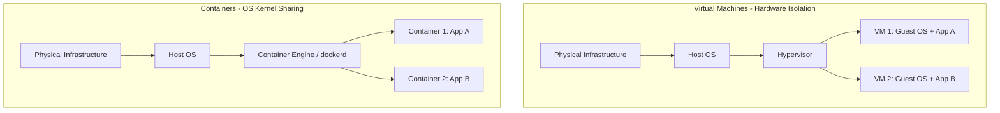

# 📦 Unit 1: DevOps & Containerization Fundamentals

Welcome to the documentation for **Unit 1**. This unit covers the fundamental concepts that bridge software development and IT operations (DevOps) and introduces the core technologies behind containerized applications.

---

## 📖 Topics & Notes Index

This folder contains the following detailed study guides:

| File | Core Subject | Key Learning Points |
| :--- | :--- | :--- |
| 📄 [01_Introduction_to_DevOps.md](01_Introduction_to_DevOps.md) | **DevOps Culture & Lifecycle** | Explains the DevOps lifecycle (Plan → Develop → Build → Test → Release → Deploy → Operate → Monitor), collaboration benefits, and solving the "works on my machine" problem. |
| 📄 [02_Introduction_to_Containers.md](02_Introduction_to_Containers.md) | **Virtualization vs. Containerization** | Real-world analogies for virtual machines (heavy, full guest OS) vs. containers (lightweight, shared host kernel). Includes Docker Engine intro. |
| 📄 [03_Container_Fundamentals.md](03_Container_Fundamentals.md) | **Kernel Mechanisms & Isolation** | Explores Linux **Namespaces** (PID, Network, Mount, UTS) for process isolation and **cgroups** for resource limiting (CPU, Memory, PIDs). |
| 📄 [04_Docker_Complete_Guide.md](04_Docker_Complete_Guide.md) | **Docker Engine Architecture** | Complete guide on the Docker Client-Server model (CLI, dockerd, registries), image layers, building custom images, and basic lifecycle commands. |

---

## 🏛️ Core Concept: Virtual Machines vs. Containers

Here is a visual comparison of how virtual machines differ from containers at the system level:

---

## 💡 Quick Recall: Namespaces vs. cgroups

> [!NOTE]
> **Namespaces (Isolation):** Limit **what** a container can see (e.g., process list, network ports, filesystem).
>
> **cgroups (Limits):** Limit **how much** resources a container can consume (e.g., maximum memory, CPU cores, process count).

- **PID Namespace:** Gives the container its own process tree (the main application runs as PID 1).
- **Network Namespace:** Gives the container its own internal IP and network ports.
- **cgroups limit example:** `docker run -d --memory 512m --cpus 1.0 nginx`

---

## 🏃‍♂️ Practice Checklist

Before moving to Unit 2, ensure you can:
- [x] Run an interactive Ubuntu container: `docker run -it ubuntu bash`
- [x] Inspect processes inside a running container: `docker top [container_name]`
- [x] Check local system resource usages for containers: `docker stats`
- [x] Clean up unused Docker objects: `docker system prune`
