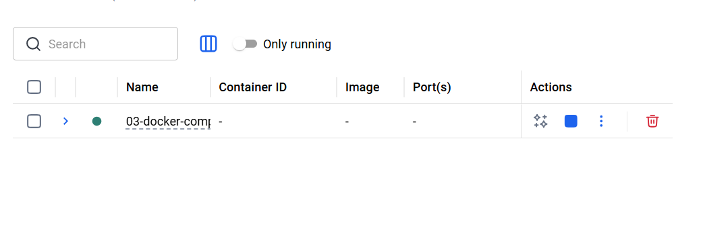
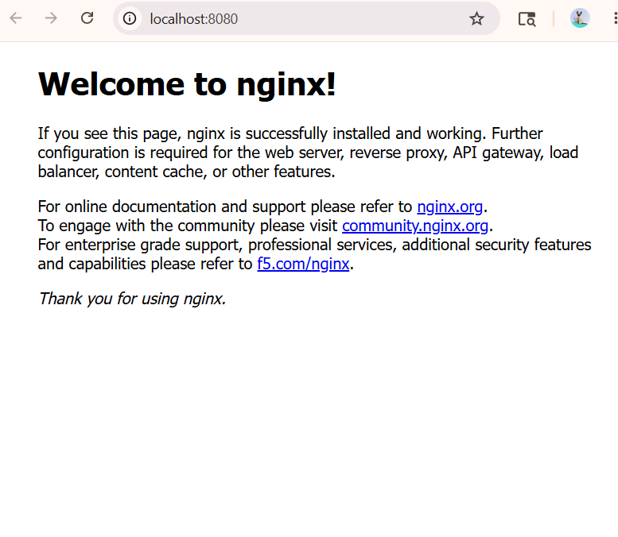

# Practical 01 - Docker Compose Basics

# Aim

To understand the basics of Docker Compose and deploy an Nginx container using a docker-compose.yml file.

---

# Problem Statement

Create a Docker Compose configuration file to run an Nginx web server container and verify the deployment using Docker Desktop and browser.

---

# Requirements

- Docker Desktop
- Docker Compose
- VS Code

---

# Docker Compose File

```yaml
services:
  web:
    image: nginx
    ports:
      - "8080:80"
```

---

# Explanation

## services
Defines all containers used in the application.

---

## web
Name of the service.

---

## image: nginx
Pulls official Nginx image from Docker Hub.

---

## ports
Maps host port to container port.

```text
8080 → Host Port
80 → Container Port
```

---

# Steps Performed

## Step 1: Open Project Folder

Navigate to:

```text
C:\Users\Lenovo\OneDrive\Desktop\devops2\unit3\03-Docker-Compose-Basics
```

---

## Step 2: Create docker-compose.yml

Created Docker Compose configuration file.

---

## Step 3: Run Docker Compose

Command used:

```bash
docker compose up -d
```

---

## Step 4: Verify Running Container

Command used:

```bash
docker compose ps
```

---

## Step 5: Open Browser

Visited:

```text
http://localhost:8080
```

Verified Nginx web server output.

---

# Output Screenshots

## 1. Docker Compose File


---

## 2. Docker Compose Up


---

## 3. Running Containers


---

## 4. Docker Desktop Running Container



---

## 5. Browser Output



---

# Result

Successfully created and deployed an Nginx container using Docker Compose.

---

# Conclusion

Docker Compose simplifies container deployment and management using a single YAML configuration file.