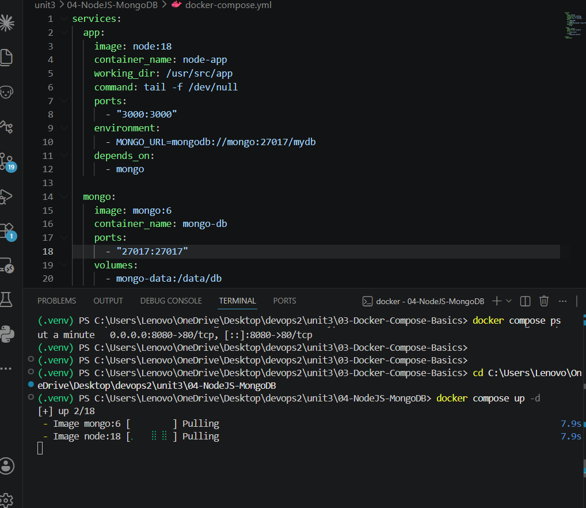
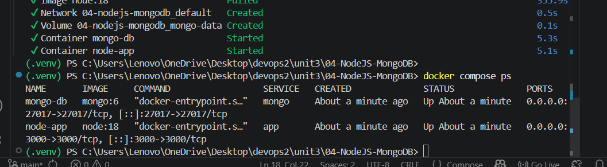
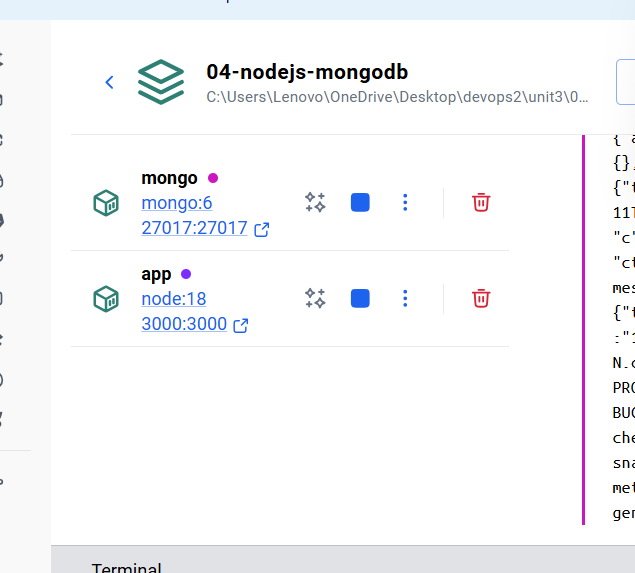
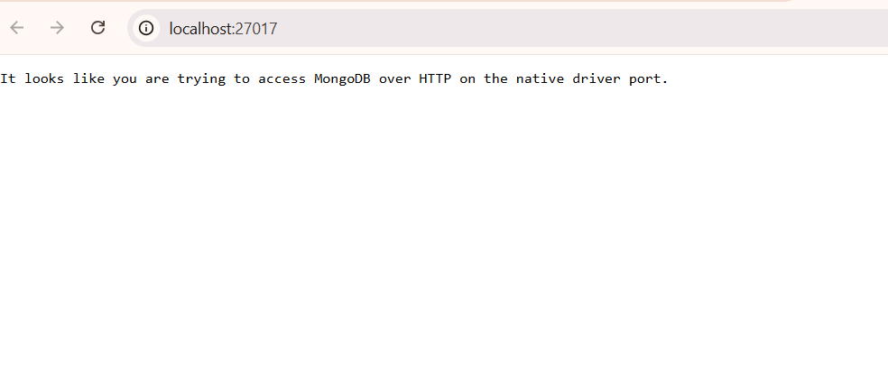

# Practical 01 - Node.js + MongoDB using Docker Compose

# Aim

To deploy Node.js and MongoDB containers using Docker Compose.

---

# Problem Statement

Create a multi-container Docker Compose setup containing:
- Node.js application container
- MongoDB database container

Verify container deployment using Docker Desktop and browser.

---

# Requirements

- Docker Desktop
- Docker Compose
- VS Code

---

# Docker Compose File

```yaml
services:
  app:
    image: node:18
    container_name: node-app
    working_dir: /usr/src/app
    command: tail -f /dev/null
    ports:
      - "3000:3000"
    environment:
      - MONGO_URL=mongodb://mongo:27017/mydb
    depends_on:
      - mongo

  mongo:
    image: mongo:6
    container_name: mongo-db
    ports:
      - "27017:27017"
    volumes:
      - mongo-data:/data/db

volumes:
  mongo-data:
```

---

# Steps Performed

## Step 1: Open Project Folder

Opened:

```text
04-NodeJS-MongoDB
```

---

## Step 2: Create docker-compose.yml

Created Docker Compose configuration file.

---

## Step 3: Run Docker Compose

Command used:

```bash
docker compose up -d
```

---

## Step 4: Verify Running Containers

Command used:

```bash
docker compose ps
```

---

## Step 5: Verify in Docker Desktop

Checked running containers in Docker Desktop.

---

## Step 6: Open Browser

Visited:
- `http://localhost:3000`
- `http://localhost:27017`

---

# Output Screenshots

## 1. Docker Compose File


---

## 2. Docker Compose Up



---

## 3. Running Containers



---

## 4. Docker Desktop Running Containers



---

## 5. Node.js Browser Output


---

## 6. MongoDB Browser Output



---

# Result

Successfully deployed Node.js and MongoDB containers using Docker Compose.

---

# Conclusion

Docker Compose enables easy deployment and management of multi-container applications with networking and persistent storage support.