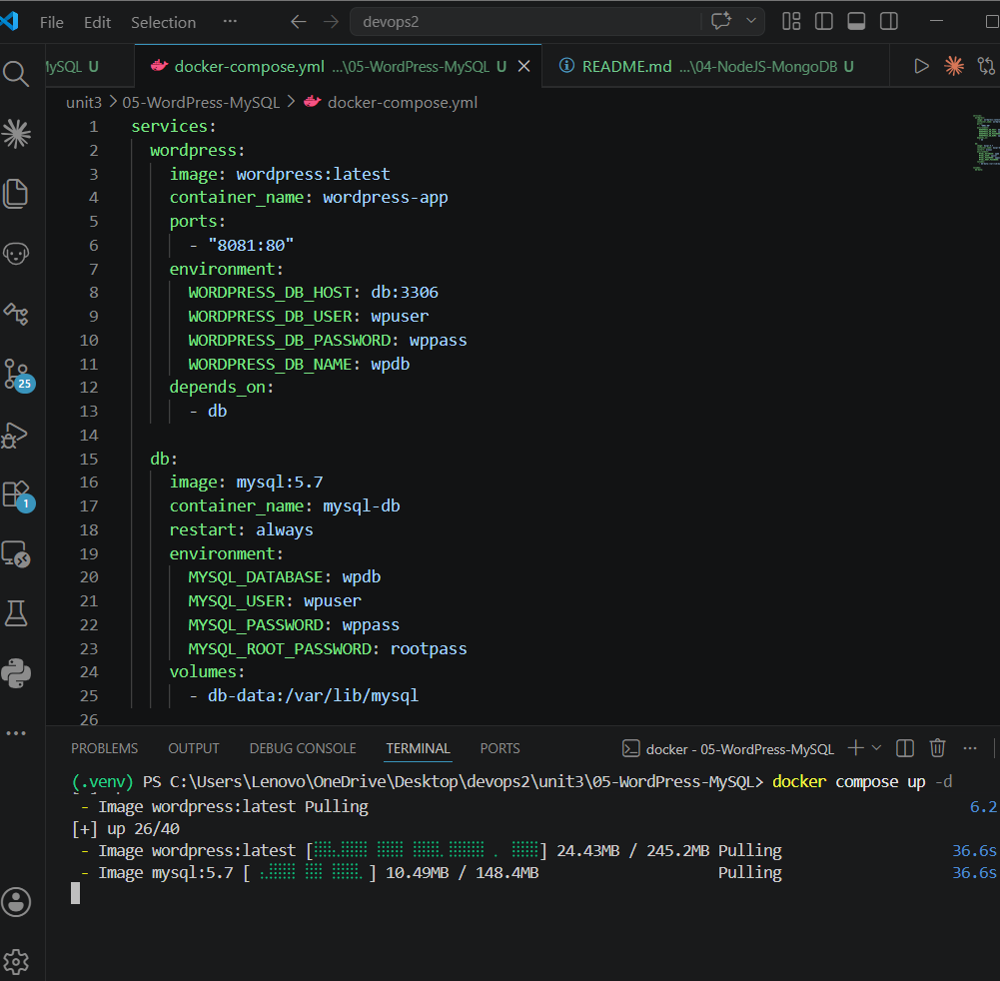
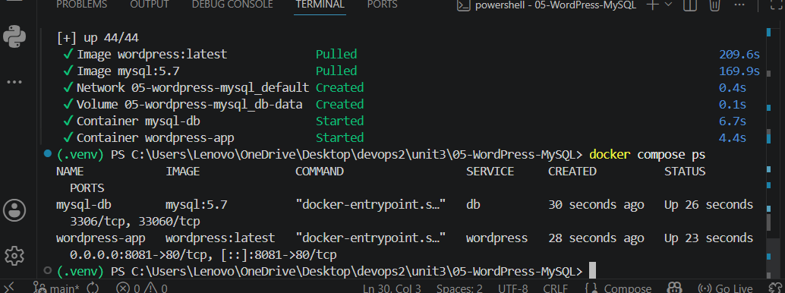
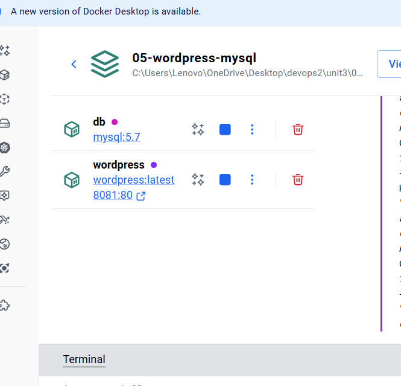
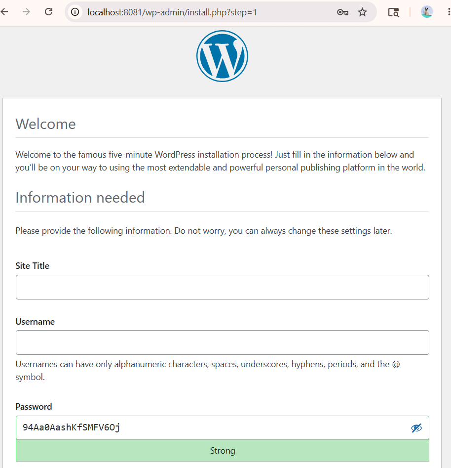

# Practical 01 - WordPress + MySQL using Docker Compose

# Aim

To deploy WordPress and MySQL containers using Docker Compose.

---

# Problem Statement

Create a Docker Compose setup containing:
- WordPress container
- MySQL database container

Verify deployment using Docker Desktop and browser.

---

# Requirements

- Docker Desktop
- Docker Compose
- VS Code

---

# Docker Compose File

```yaml
services:
  wordpress:
    image: wordpress:latest
    container_name: wordpress-app
    ports:
      - "8081:80"
    environment:
      WORDPRESS_DB_HOST: db:3306
      WORDPRESS_DB_USER: wpuser
      WORDPRESS_DB_PASSWORD: wppass
      WORDPRESS_DB_NAME: wpdb
    depends_on:
      - db

  db:
    image: mysql:5.7
    container_name: mysql-db
    restart: always
    environment:
      MYSQL_DATABASE: wpdb
      MYSQL_USER: wpuser
      MYSQL_PASSWORD: wppass
      MYSQL_ROOT_PASSWORD: rootpass
    volumes:
      - db-data:/var/lib/mysql

volumes:
  db-data:
```

---

# Steps Performed

## Step 1: Open Project Folder

Opened:

```text
05-WordPress-MySQL
```

---

## Step 2: Create docker-compose.yml

Created Docker Compose configuration file.

---

## Step 3: Run Docker Compose

Command used:

```bash
docker compose up -d
```

---

## Step 4: Verify Running Containers

Command used:

```bash
docker compose ps
```

---

## Step 5: Verify in Docker Desktop

Checked running containers in Docker Desktop.

---

## Step 6: Open Browser

Visited:

```text
http://localhost:8081
```

Verified WordPress setup page.

---

# Output Screenshots


## 1. Docker Compose Up



---

## 2. Running Containers



---

## 3. Docker Desktop Running Containers



---

## 4. WordPress Browser Output



---

# Result

Successfully deployed WordPress and MySQL containers using Docker Compose.

---

# Conclusion

Docker Compose enables efficient deployment and management of multi-container web applications.