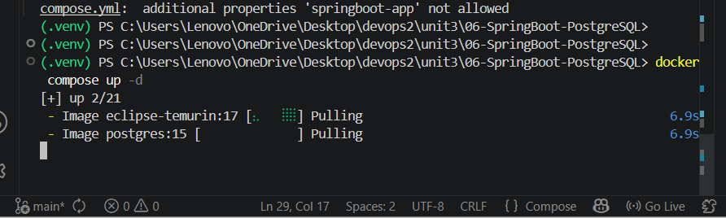
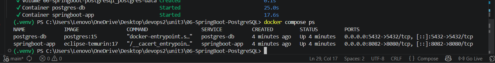
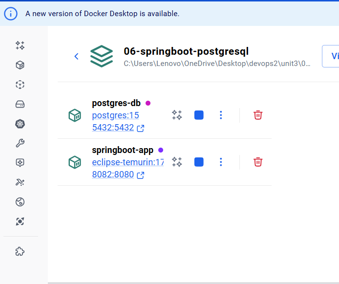

# Practical 01 - Spring Boot + PostgreSQL using Docker Compose

# Aim

To deploy Spring Boot and PostgreSQL containers using Docker Compose.

---

# Problem Statement

Create a Docker Compose setup containing:
- Spring Boot application container
- PostgreSQL database container

Verify deployment using Docker Desktop and browser.

---

# Requirements

- Docker Desktop
- Docker Compose
- VS Code

---

# Docker Compose File

```yaml
services:
  springboot-app:
    image: eclipse-temurin:17
    container_name: springboot-app
    working_dir: /app
    command: tail -f /dev/null
    ports:
      - "8082:8080"
    environment:
      SPRING_DATASOURCE_URL: jdbc:postgresql://postgres-db:5432/mydb
      SPRING_DATASOURCE_USERNAME: postgres
      SPRING_DATASOURCE_PASSWORD: postgres
    depends_on:
      - postgres-db

  postgres-db:
    image: postgres:15
    container_name: postgres-db
    environment:
      POSTGRES_DB: mydb
      POSTGRES_USER: postgres
      POSTGRES_PASSWORD: postgres
    ports:
      - "5432:5432"
    volumes:
      - postgres-data:/var/lib/postgresql/data

volumes:
  postgres-data:
```

---

# Steps Performed

## Step 1: Open Project Folder

Opened:

```text
06-SpringBoot-PostgreSQL
```

---

## Step 2: Create docker-compose.yml

Created Docker Compose configuration file.

---

## Step 3: Run Docker Compose

Command used:

```bash
docker compose up -d
```

---

## Step 4: Verify Running Containers

Command used:

```bash
docker compose ps
```

---

## Step 5: Verify in Docker Desktop

Checked running containers in Docker Desktop.

---

## Step 6: Open Browser

Visited:
- `http://localhost:8082`
- `http://localhost:5432`

---

# Output Screenshots

## 1. Docker Compose Up



---

## 2. Running Containers



---

## 3. Docker Desktop Running Containers



---

## 4. PostgreSQL Browser Output


---

## 5. Spring Boot Browser Output


---

# Result

Successfully deployed Spring Boot and PostgreSQL containers using Docker Compose.

---

# Conclusion

Docker Compose enables efficient deployment and management of Spring Boot and PostgreSQL multi-container applications.