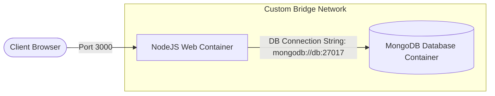
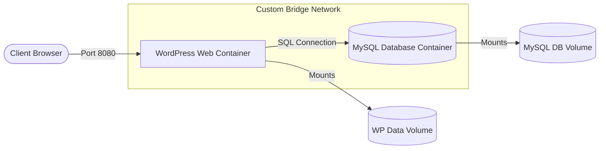

# 🐳 Unit 3: Microservices & Multi-Container Orchestration (Docker Compose)

Welcome to **Unit 3**. This unit transitions from single-container management to orchestrating multi-container systems. You will learn to write declarative YAML configuration files (`docker-compose.yml`) to define, link, deploy, and scale complex microservices applications in isolated local networks.

---

## 🛠️ Tech Stack & Services


---

## 📖 Topics & Projects Directory

| Subdirectory | Focus | Core Concept | Key Files |
| :--- | :--- | :--- | :--- |
| 📁 [01-Monolithic-vs-Microservices](01-Monolithic-vs-Microservices/) | **Architecture Theory** | Tightly coupled vs. loosely coupled architectures, scaling limits, and fault isolation models. | [Theory Notes](01-Monolithic-vs-Microservices/README.md) |
| 📁 [02-Containers](02-Containers/) | **Container Ecosystem** | Deep-dive into runtime requirements for microservice-based applications. | [Container Notes](02-Containers/README.md) |
| 📁 [03-Docker-Compose-Basics](03-Docker-Compose-Basics/) | **Compose Specifications** | YAML syntax, services mapping, environment injection, and standard networks. | [Compose Basics](03-Docker-Compose-Basics/README.md)<br>[docker-compose.yml](03-Docker-Compose-Basics/docker-compose.yml) |
| 📁 [04-NodeJS-MongoDB](04-NodeJS-MongoDB/) | **Node.js Web App** | Connecting a Node web server container to a MongoDB database container with health dependency checks. | [NodeJS Guide](04-NodeJS-MongoDB/README.md)<br>[docker-compose.yml](04-NodeJS-MongoDB/docker-compose.yml) |
| 📁 [05-WordPress-MySQL](05-WordPress-MySQL/) | **LAMP Stack App** | Deploying a CMS container with volume mappings and a MySQL database backend. | [WordPress Guide](05-WordPress-MySQL/README.md)<br>[docker-compose.yml](05-WordPress-MySQL/docker-compose.yml) |
| 📁 [06-SpringBoot-PostgreSQL](06-SpringBoot-PostgreSQL/) | **Spring Boot API** | Creating a Java REST API container that communicates with PostgreSQL database backend. | [Spring Boot Guide](06-SpringBoot-PostgreSQL/README.md)<br>[docker-compose.yml](06-SpringBoot-PostgreSQL/docker-compose.yml) |

---

## 📐 Multi-Container Topologies (Architecture)

Below are the architectural topologies of the multi-container projects implemented in this unit:

### 1️⃣ Node.js Backend & MongoDB Database


### 2️⃣ WordPress CMS & MySQL Database


---

## ⌨️ Essential Docker Compose CLI Commands

> [!TIP]
> Ensure you run all commands from the directory containing your target `docker-compose.yml` file.

*   **Start all services in background:**
    ```bash
    docker-compose up -d
    ```
*   **Stop and remove containers, networks, and default volumes:**
    ```bash
    docker-compose down
    ```
*   **List statuses of all orchestrated services:**
    ```bash
    docker-compose ps
    ```
*   **Tail real-time logs from all services:**
    ```bash
    docker-compose logs -f
    ```
*   **Build or rebuild custom images listed in the compose file:**
    ```bash
    docker-compose build
    ```
*   **Run a one-off command inside a running service container:**
    ```bash
    docker-compose exec [service_name] [command]
    ```
