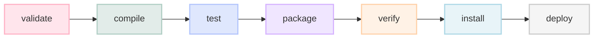

# 🏗️ Unit 4: Maven - Build Automation & Project Management

Welcome to **Unit 4**. This unit covers **Apache Maven**, a powerful software project management and comprehension tool. Based on the concept of a Project Object Model (POM), Maven can manage a Java project's build, reporting, and documentation from a central configuration file.

---

## 🛠️ Technology Integration


---

## 📖 Topics & Subdirectories

This unit is organized into the following specialized learning paths:

| Subdirectory | Target Area | Key Concepts | Link to Guide |
| :--- | :--- | :--- | :--- |
| 📁 [01-Maven-Introduction](01-Maven-Introduction/) | **Introduction** | What is Maven? Why choose Maven over Ant or Gradle? Directory conventions. | [Intro Guide](01-Maven-Introduction/README.md) |
| 📁 [02-POM-Structure](02-POM-Structure/) | **Project Object Model** | Deep-dive into `pom.xml`, coordinates (`groupId`, `artifactId`, `version`), dependencies, and properties. | [POM Structure Guide](02-POM-Structure/README.md) |
| 📁 [03-Maven-Lifecycle](03-Maven-Lifecycle/) | **Build Lifecycles** | Understanding clean, default, and site lifecycles. Phases vs. plugin goals. | [Lifecycle Guide](03-Maven-Lifecycle/README.md) |
| 📁 [04-Dependency-Management](04-Dependency-Management/) | **Dependencies** | Central repositories, transitive dependencies, exclusions, and conflict resolution. | [Dependency Guide](04-Dependency-Management/README.md) |
| 📁 [05-Maven-Plugins](05-Maven-Plugins/) | **Extensibility** | Build plugins vs. reporting plugins. Binding plugin goals to build phases. | [Plugins Guide](05-Maven-Plugins/README.md) |
| 📁 [06-Maven-Docker-Integration](06-Maven-Docker-Integration/) | **Dockerization** | Multi-stage Docker builds containerizing Maven-compiled Java applications. | [Docker Integration](06-Maven-Docker-Integration/README.md) |

---

## 🔄 Maven Lifecycle Flow (Default Lifecycle)

> [!NOTE]
> When you run a command representing a specific phase, Maven executes **all preceding phases** in that lifecycle sequence.
> For example: running `mvn package` will execute `validate` → `compile` → `test` → `package`.



---

## 📦 Dependency Scopes Matrix

Maven uses dependency scopes to limit the transitivity of dependencies and determine when a dependency is included on the classpath (compile, test, runtime).

| Scope | Classpath: Compile | Classpath: Test | Classpath: Runtime | Packaged in Artifact? | Typical Use Case |
| :--- | :---: | :---: | :---: | :---: | :--- |
| **`compile`** (default) | Yes | Yes | Yes | **Yes** | Standard library (e.g. Apache Commons, Log4j). |
| **`provided`** | Yes | Yes | No | **No** | APIs provided by container (e.g. Servlet API). |
| **`runtime`** | No | Yes | Yes | **Yes** | Database JDBC Drivers (needed only at runtime). |
| **`test`** | No | Yes | No | **No** | Test frameworks (e.g. JUnit, Mockito). |
| **`system`** | Yes | Yes | Yes | **No** | Locally referenced JARs (must provide explicit path). |

---

## ⌨️ Essential Maven Command Checklist

*   **Clean the build directory (`/target`) and run unit tests:**
    ```bash
    mvn clean test
    ```
*   **Compile the code, run tests, and package into a JAR/WAR:**
    ```bash
    mvn clean package
    ```
*   **Package the application and install it into local repository (`~/.m2/repository`):**
    ```bash
    mvn clean install
    ```
*   **Show visual tree of project dependencies (highly useful for resolving version conflicts):**
    ```bash
    mvn dependency:tree
    ```
*   **Run a specific plugin goal (e.g. compile code without executing lifecycle):**
    ```bash
    mvn compiler:compile
    ```

---

## 📝 Practice Exercises

Looking to evaluate your knowledge?
👉 Review the [practice-questions.md](practice-questions.md) file for extensive questions, answers, and build automation exercises.
