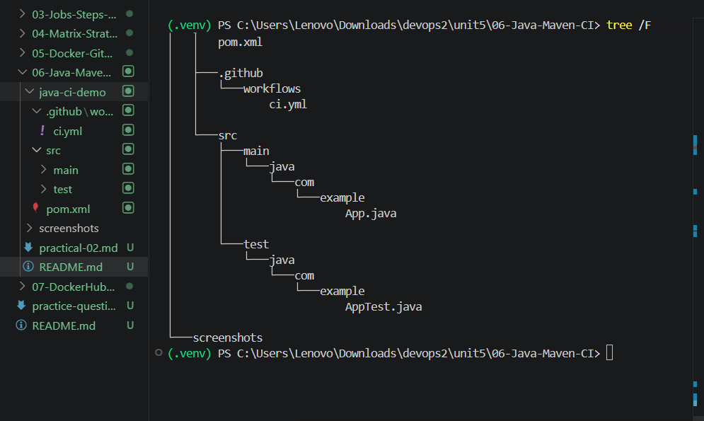
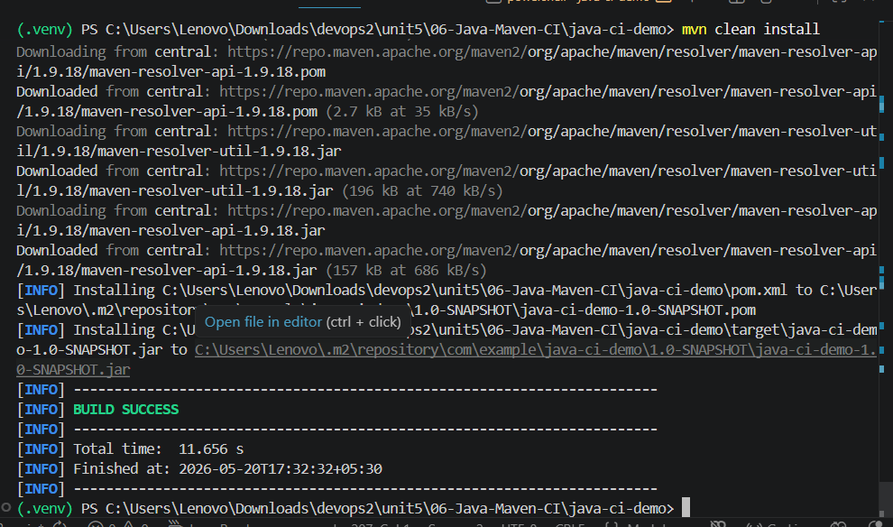
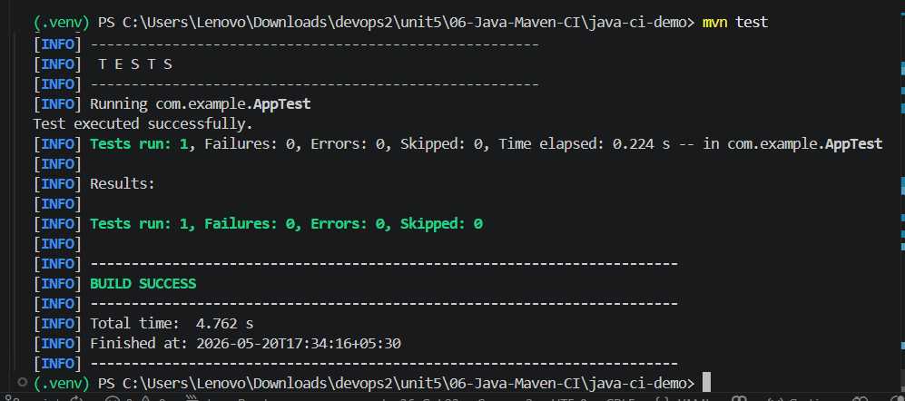
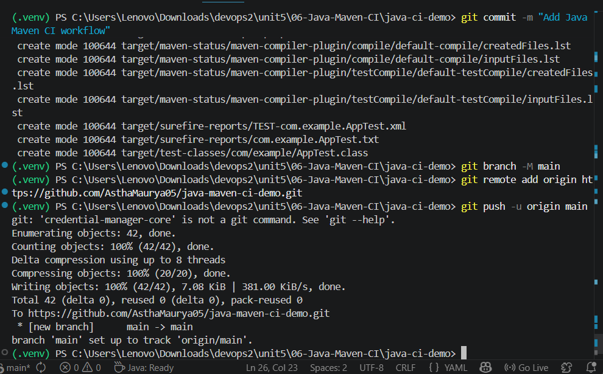
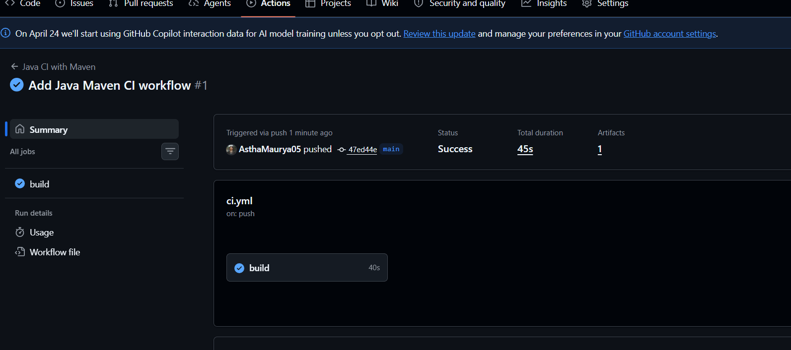
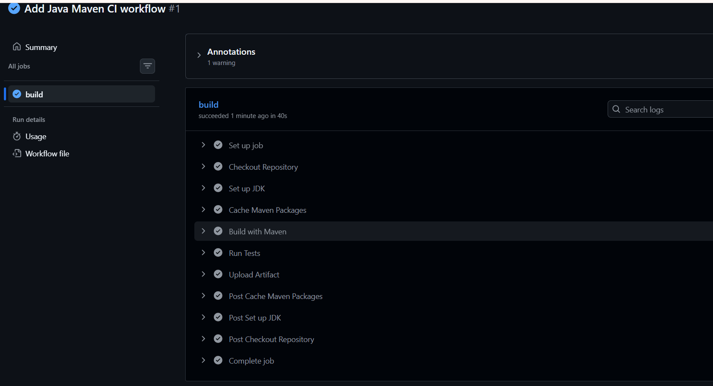
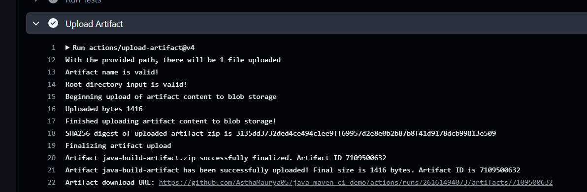

# Practical 02 — Java Maven CI with GitHub Actions

## Aim

To automate Java Maven project build, testing, and artifact generation using GitHub Actions Continuous Integration (CI) workflow.

---

## Problem Statement

Create a Java Maven project and configure GitHub Actions workflow to automatically:

- Build the Maven project
- Run unit tests
- Cache Maven dependencies
- Generate build artifact
- Execute CI workflow on every GitHub push

---

## Tools & Technologies Used

- Java
- Maven
- GitHub Actions
- GitHub
- VS Code

---

## Solution

### Step 1 — Create Maven Project

Created Java Maven project manually.

Files created:

- `pom.xml`
- `App.java`
- `AppTest.java`

Project Structure:

```text
java-ci-demo/
│
├── pom.xml
├── .github/
│   └── workflows/
│       └── ci.yml
│
├── src/
│   ├── main/
│   │   └── java/
│   │       └── com/example/App.java
│   │
│   └── test/
│       └── java/
│           └── com/example/AppTest.java
```

---

### Step 2 — Configure GitHub Actions Workflow

Created workflow file:

```text
.github/workflows/ci.yml
```

Workflow automatically triggers on push to GitHub.

**ci.yml**

```yaml
name: Java CI with Maven

on:
  push:
    branches:
      - main

jobs:

  build:

    runs-on: ubuntu-latest

    steps:

      - name: Checkout Repository
        uses: actions/checkout@v4

      - name: Setup JDK
        uses: actions/setup-java@v4
        with:
          distribution: 'temurin'
          java-version: '21'

      - name: Cache Maven Packages
        uses: actions/cache@v4
        with:
          path: ~/.m2
          key: maven-${{ runner.os }}

      - name: Build with Maven
        run: mvn clean install

      - name: Run Tests
        run: mvn test

      - name: Upload Artifact
        uses: actions/upload-artifact@v4
        with:
          name: java-build-artifact
          path: target/*.jar
```

---

### Step 3 — Build Maven Project Locally

Executed local Maven build.

Command:

```bash
mvn clean install
```

Output:

```text
BUILD SUCCESS
```

---

### Step 4 — Run Maven Tests

Executed project tests.

Command:

```bash
mvn test
```

Output:

```text
BUILD SUCCESS
```

Unit tests executed successfully.

---

### Step 5 — Push Project to GitHub

Commands used:

```bash
git init
git add .
git commit -m "Add Java Maven CI workflow"
git branch -M main
git remote add origin https://github.com/AsthaMaurya05/java-maven-ci-demo.git
git push -u origin main
```

---

### Step 6 — GitHub Actions Workflow Execution

After pushing code:

GitHub Actions automatically triggered CI workflow.

Pipeline executed following stages:

- Checkout Repository
- Setup JDK
- Cache Maven Dependencies
- Build Project
- Run Tests
- Upload Artifact

---

### Step 7 — Verify Workflow Success

Workflow completed successfully.

Verified:

- Maven build success
- Test success
- Artifact upload success
- Workflow completion success

---

## Screenshots

### Project Structure

```text
screenshots/project-structure.png.png
```



---

### Local Maven Build Success

```text
screenshots/maven-build-success.png.png
```



---

### Maven Test Success

```text
screenshots/maven-test-success.png.png
```



---

### Git Push

```text
screenshots/git-push.png.png
```



---

### Workflow Triggered / Workflow Success

```text
screenshots/workflow-success.png.png
```



---

### Workflow Logs

```text
screenshots/workflow-logs.png.png
```



---

### Artifact Upload

```text
screenshots/artifact-upload.png.png
```




---

## Result

Successfully implemented Continuous Integration (CI) pipeline for Java Maven project using GitHub Actions. Maven build, test execution, workflow automation, and artifact upload completed successfully.
