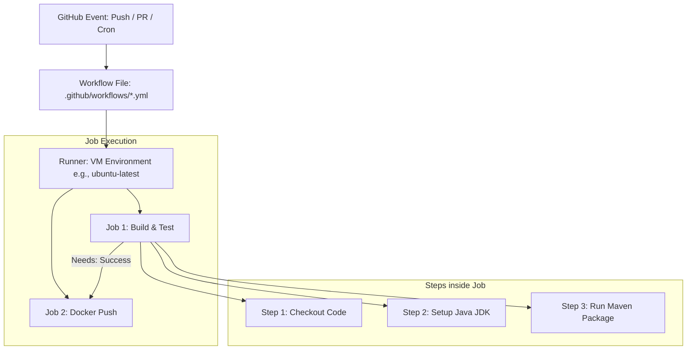

# ⚡ Unit 5: GitHub Actions CI/CD

Welcome to **Unit 5**. This unit covers **GitHub Actions**, a native CI/CD orchestrator built directly into GitHub. You will learn how to design automated software delivery pipelines that run tests, compile binaries, build container images, and deploy applications in response to version control events.

---

## 🛠️ Integrated Technologies

---

## 📖 Topics & Folders Index

Explore the folders below to learn declarative workflow components:

| Subdirectory | Core Focus | Concepts Explored | Link to Study Guide |
| :--- | :--- | :--- | :--- |
| 📁 [01-Introduction-to-GitHub-Actions](01-Introduction-to-GitHub-Actions/) | **Workflow Basics** | CI/CD concepts, `.github/workflows/` directory structure, YAML configuration schema. | [Intro Guide](01-Introduction-to-GitHub-Actions/README.md) |
| 📁 [02-Workflow-Triggers](02-Workflow-Triggers/) | **Automation Triggers** | Webhook events (pull request, push), activity types, manual dispatch, and cron schedules. | [Triggers Guide](02-Workflow-Triggers/README.md) |
| 📁 [03-Jobs-Steps-Actions-Runners](03-Jobs-Steps-Actions-Runners/) | **Execution Model** | Runners (GitHub-hosted vs. Self-hosted), Job concurrency, dependencies, steps, shell commands. | [Jobs & Steps Guide](03-Jobs-Steps-Actions-Runners/README.md) |
| 📁 [04-Matrix-Strategies-Caching](04-Matrix-Strategies-Caching/) | **Advanced Pipelines** | Matrix strategies (cross-platform/language testing), environment variables, caching dependencies. | [Advanced Guide](04-Matrix-Strategies-Caching/README.md) |
| 📁 [05-Docker-GitHub-Actions](05-Docker-GitHub-Actions/) | **Containerization CI** | Creating Docker Hub connection credentials, building images, and pushing to registries inside pipelines. | [Docker CI Guide](05-Docker-GitHub-Actions/README.md) |
| 📁 [06-Java-Maven-CI](06-Java-Maven-CI/) | **Java/Maven Workflows** | Setting up JDK, integrating Maven test & package lifecycles, and caching `~/.m2` dependencies. | [Java CI Guide](06-Java-Maven-CI/README.md) |

---

## 📐 GitHub Actions Architecture (Workflow Model)

Here is a visual map showing how GitHub Actions processes configuration files:

---

## 📅 Common Workflow Triggers

Configure the `on:` keyword in your YAML files to control execution triggers:

| Event Type | Syntax Example | When it runs |
| :--- | :--- | :--- |
| **Push** | `on: [push]` | Executes whenever code is pushed to any branch in the repository. |
| **Filtered Push** | `on: push:   branches: [main]` | Restricts execution to pushes made specifically to the `main` branch. |
| **Pull Request** | `on: [pull_request]` | Runs when a Pull Request is opened, updated, or synchronized. |
| **Manual Dispatch** | `on: workflow_dispatch` | Adds a "Run workflow" button in the GitHub Actions UI for manual trigger. |
| **Scheduled Cron** | `on:   schedule:     - cron: '0 0 * * *'` | Automatically runs the workflow on a scheduled time (e.g., daily at midnight UTC). |

---

## 💡 Best Practices for Workflows

> [!TIP]
> **Use Secrets Management:** Never hardcode passwords or API keys in your repository. Use `secrets.VAR_NAME` and register them under *Repository Settings → Secrets and Variables → Actions*.
>
> **Cache Dependency Directories:** Speeds up builds by reusing packages. Use `actions/cache` or setup integrations (e.g., `actions/setup-java` has native `cache: 'maven'` support).
