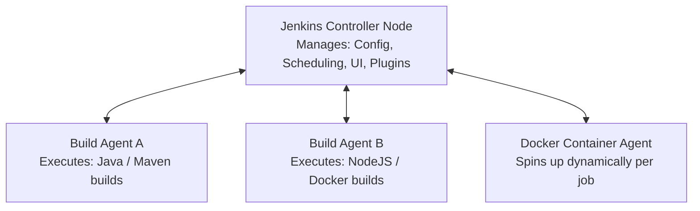

# 🔗 Unit 6: Jenkins CI/CD

Welcome to **Unit 6**. This unit focuses on **Jenkins**, the leading open-source automation server. You will explore distributed build topologies (Controller-Agent), understand the plugin ecosystem, and master the creation of Scripted and Declarative pipelines using Groovy scripts to orchestrate advanced software delivery tasks.

---

## 🛠️ Integrated Technologies

---

## 📖 Topics & Folders Index

Browse the directories below to understand pipeline architecture:

| Subdirectory | Core Study Area | Practical Topics | Link to Study Guide |
| :--- | :--- | :--- | :--- |
| 📁 [01-Introduction-to-Jenkins](01-Introduction-to-Jenkins/) | **Jenkins Core Concepts** | Jenkins architecture, installation methods, war deployments, and web dashboard basics. | [Intro Guide](01-Introduction-to-Jenkins/README.md) |
| 📁 [02-Jenkins-Jobs-Builds-Nodes](02-Jenkins-Jobs-Builds-Nodes/) | **Distributed Architecture** | Creating builds, scheduling execution logs, and configuring Controller-Agent node distributions. | [Jobs & Nodes Guide](02-Jenkins-Jobs-Builds-Nodes/README.md) |
| 📁 [03-Jenkins-Pipelines](03-Jenkins-Pipelines/) | **Jenkinsfile Development** | Writing Scripted and Declarative pipelines, triggers, parameters, environment setups. | [Pipelines Guide](03-Jenkins-Pipelines/README.md) |
| 📁 [04-Jenkins-Plugins](04-Jenkins-Plugins/) | **Plugin Ecosystem** | Installing plugins, using credentials manager, integrating Git, Docker, and Maven plugins. | [Plugins Guide](04-Jenkins-Plugins/README.md) |
| 📁 [05-End-to-End-Jenkins-CICD](05-End-to-End-Jenkins-CICD/) | **Advanced Pipelines** | Implementing full automated pipelines: Checkout → Code Analysis → Maven Build → Docker Publish. | [End-to-End Guide](05-End-to-End-Jenkins-CICD/README.md) |

---

## 📐 Jenkins Distributed Topology (Controller-Agent)

Jenkins delegates actual compilation and deployment tasks to secondary node environments (Agents) to prevent resource congestion on the core server dashboard.

---

## 🆚 Scripted vs. Declarative Pipelines

Jenkins supports two programming models for writing pipeline definitions in a `Jenkinsfile`:

| Feature | Declarative Pipeline (Modern Standard) | Scripted Pipeline (Legacy/Flexible) |
| :--- | :--- | :--- |
| **Syntactic Wrapper** | Wrapped in strict `pipeline { ... }` blocks. | Wrapped in flexible `node { ... }` blocks. |
| **Design Model** | Declarative, user-friendly, structured configuration. | Imperative, script-based execution logic. |
| **Error Checking** | Syntax checked by Jenkins engine before starting. | Syntax checked line-by-line during runtime execution. |
| **Groovy Code** | Must be enclosed inside an explicit `script { ... }` block. | Can write raw Groovy code anywhere in the script. |
| **Syntax Elements** | `agent`, `stages`, `stage`, `steps`, `post` blocks. | Uses Groovy loops, try-catch blocks, variables freely. |

---

## 💡 Best Practices for Jenkins Pipelines

> [!NOTE]
> **Use Jenkinsfile:** Avoid configuring build steps directly inside the Jenkins web UI. Keep your pipelines defined in a version-controlled `Jenkinsfile` inside your codebase.
>
> **Distributed Execution:** Never run intensive compilation workloads directly on the Jenkins Controller. Always set up and target explicit Agents using `agent { label 'maven-agent' }`.
